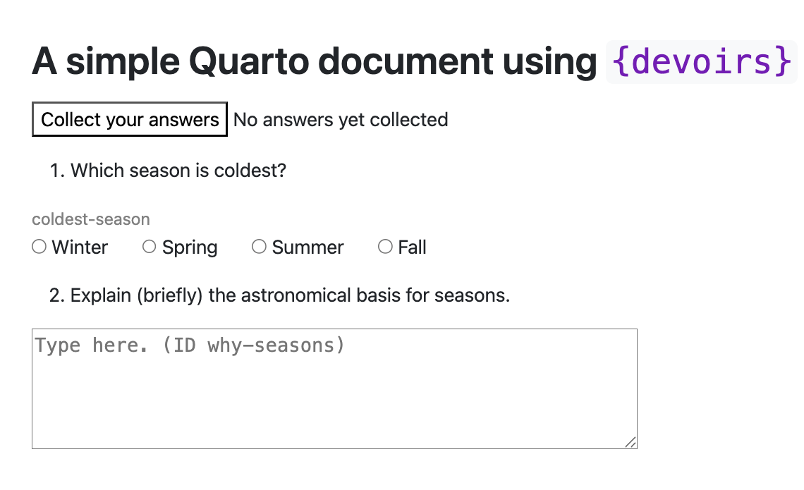

```{r, include = FALSE}
knitr::opts_chunk$set(
  collapse = TRUE,
  comment = "#>"
)
library(devoirs)
```

`{devoirs}` provides utilities for the collection of student work, either in essay form or answers to multiple-choice questions. This document describes how to write *documents* that work with the `{devoirs}` utilities.

## Assignment documents

To set the stage, imagine that you are composing an assignment for your students from which you will collect student answers. But exactly the same structure would apply to any other document, for instance, a book chapter or a blog post, in which you want to use `{devoirs}`.

For simplicity, we will assume you are using the Quarto system to create a `.qmd` document and compile it to HTML form. You also need to deploy the HTML version of the document to a web server, which you might do with a system like Moodle or Canvas, or a github gh-pages site, or whereever. 

To "give" the assignment to students, provide students a link to the HTML document on its server. This link might reside in a course syllabus or schedule or even just an email. 

Here is a very simple assignment document to get you started.

```{embed, file="../inst/Examples/Simple-example.qmd", lang="markdown"}
```

1. This text would be placed in a `.qmd` file, let's say `simple.qmd`

2. Render the file with quarto to produce the HTML counterpart: `simple.html`

3. Place `simple.html` on a web server and provide students a link to it.

When rendered, the document will look like this:



You can see ...
